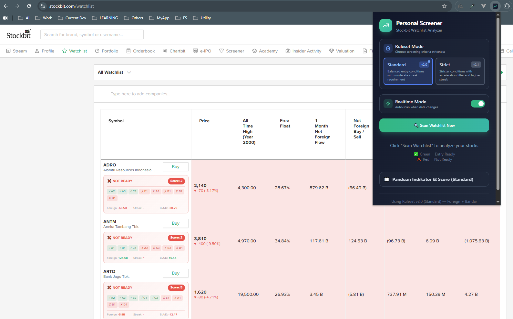

# Stockbit Personal Screener

Chrome Extension untuk screening saham di Stockbit Watchlist berdasarkan indikator **Foreign Flow** dan **Bandar Accumulation**.

## Apa Ini?

Extension ini membantu trader/investor untuk:
- **Scan otomatis** watchlist Stockbit dan evaluasi setiap saham
- **Identifikasi saham "Entry Ready"** berdasarkan kriteria foreign buy dan bandar accumulation
- **Scoring system** untuk ranking prioritas entry
- **Export data ke AI** (ChatGPT/Claude) untuk analisis lebih lanjut

## Filosofi Screening

> "Foreign confirms direction. Bandar builds structure. Flow leads price."

Extension ini menggunakan 2 indikator utama:
- **Foreign Flow** - Aktivitas beli/jual investor asing (institusi)
- **Bandar Accumulation** - Aktivitas smart money lokal

## Fitur Utama

### 1. Dual Ruleset Mode
| Mode | Deskripsi |
|------|-----------|
| **Standard (v2.0)** | Entry conditions moderat, cocok untuk swing trading |
| **Strict (v2.1)** | Filter lebih ketat dengan acceleration check, cocok untuk high-conviction entry |

### 2. Entry Conditions (Standard)
Saham dianggap "Entry Ready" jika **SEMUA** kondisi terpenuhi:
- `A1` Net Foreign Buy/Sell > 0
- `A2` Net Foreign MA10 > 0
- `A3` 1 Week Foreign Flow > 0
- `B1` Bandar Accum/Dist > 0
- `B2` Bandar Value > 0
- `C` MA20 Foreign **ATAU** Bandar MA20 > 0
- `D1` Net Foreign Streak >= 2

### 3. Hard Reject Conditions
Saham langsung ditolak jika:
- `E1` Bandar Accum/Dist < 0 (distribusi)
- `E2` Net Foreign < 0 dan Streak = 0

### 4. Scoring System
Saham yang lolos mendapat score berdasarkan kekuatan sinyal:
- +2 Bandar Value MA20 > 0
- +2 Net Foreign MA20 > 0
- +1 Net Foreign Streak >= 3
- +1 Bandar Value MA10 > 0

### 5. AI Export
Setelah scan, export hasil ke AI untuk analisis:
- **Copy** - Copy data ke clipboard
- **ChatGPT** - Langsung buka ChatGPT dengan data + prompt
- **Claude** - Langsung buka Claude.ai dengan data + prompt

Data yang dikirim ke AI sudah include prompt untuk:
- Rekomendasi saham terbaik untuk entry
- Identifikasi saham yang hampir qualify (forced entry candidates)
- Ranking prioritas berdasarkan akumulasi
- Red flags detection

### 6. Realtime Mode
Aktifkan untuk auto-scan saat data watchlist berubah.

## Screenshot



## Cara Pakai

1. Install extension (lihat bagian Installation)
2. Buka [Stockbit Watchlist](https://stockbit.com/watchlist)
3. Klik icon extension
4. Pilih ruleset (Standard/Strict)
5. Klik **"Scan Watchlist Now"**
6. Lihat hasil: saham hijau = Entry Ready, merah = Not Ready
7. Klik **ChatGPT** atau **Claude** untuk analisis AI

## Installation

### Development

```bash
# Install dependencies
npm install

# Run development server
npm run dev
```

### Production Build

```bash
npm run build
```

### Load di Chrome

1. Buka `chrome://extensions/`
2. Aktifkan **Developer mode** (toggle kanan atas)
3. Klik **Load unpacked**
4. Pilih folder `dist/`

## Tech Stack

- **Vue 3** - Composition API
- **Tailwind CSS** - Utility-first CSS framework
- **Vite** - Fast build tool
- **TypeScript** - Type safety
- **CRXJS** - Chrome extension Vite plugin

## Struktur Project

```
/
├── src/
│   ├── popup/              # Popup UI extension
│   │   ├── App.vue         # Main popup component
│   │   ├── main.ts
│   │   └── index.html
│   ├── background/         # Background service worker
│   │   └── index.ts
│   ├── content/            # Content script (table parser)
│   │   └── index.ts
│   ├── assets/
│   │   └── icons/          # Extension icons
│   ├── manifest.ts         # Chrome extension manifest v3
│   └── vite-env.d.ts
├── vite.config.ts
├── tailwind.config.js
└── package.json
```

## Scripts

| Command | Description |
|---------|-------------|
| `npm run dev` | Development dengan hot reload |
| `npm run build` | Build production ke `dist/` |
| `npm run preview` | Preview build result |

## Disclaimer

Extension ini adalah tool bantu untuk screening. Keputusan investasi tetap tanggung jawab masing-masing pengguna. Selalu lakukan analisis tambahan sebelum entry.

## License

MIT
